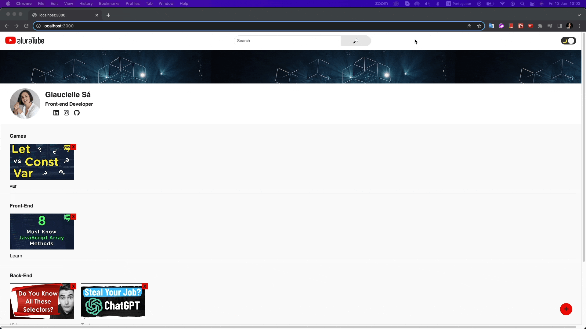

# React Immersion Alura 2022

# What is AluraTube?

AluraTube is a YouTube-inspired platform where you can save your favorite videos used in your learning journey to become a developer. So we will put our favorite videos on it and we can also share it with friends who have common interests and goals.
This project was developed in an immersion of Alura. This one was aimed at beginners in React with a focus on Next.js. The project is being developed under the guidance of Alura's instructor Mario Souto with the participation of developer Nayanne Lopes and CEO of Alura, Paulo Silveira.

 

# Technologies 🏷️

# How to use it ⚙️?

To use the application, just access this link. No login required, some of my favorite videos are shown on the application page.

**To register new videos, simply:**

1. Click on the button in the lower right corner of the screen;
2. Enter the name of the video;
3. Enter the URL of the video;
4. Select one of the three existing playlists;
5. Click "Register" to save it in the specified playlist.

# Funcionalidades 💫

- Dark and light mode
- Responsive
- List of videos separated by category Games | Front-end | Back-end
- Search filter
- Choose category when adding a video
- Save video in Supabase database including their category
- Video cover preview before saving to timeline
- Being able to remove video from the database through the interface
- Automatic screen refresh as soon as a video is saved

# Future features ⏱️

- Implement fullscreen mode
- Log in for the list to be made according to user preferences.
- Code refactoring.
